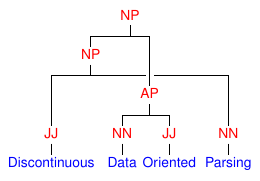

Discontinuous Data-Oriented Parsing: disco-dop
==============================================

The aim of this project is to parse discontinuous constituents in natural
language using Data-Oriented Parsing (DOP), with a focus on global world
domination. The grammar is extracted from a treebank of sentences annotated
with (discontinuous) phrase-structure trees. Concretely, this project provides
a statistical constituency parser with support for discontinuous constituents
and Data-Oriented Parsing. Discontinuous constituents are supported through the
grammar formalism Linear Context-Free Rewriting System (LCFRS), which is a
generalization of Probabilistic Context-Free Grammar (PCFG). Data-Oriented
Parsing allows re-use of arbitrary-sized fragments from previously seen
sentences using Tree-Substitution Grammar (TSG).

.. toctree::
   :maxdepth: 2

   intro
   ref

