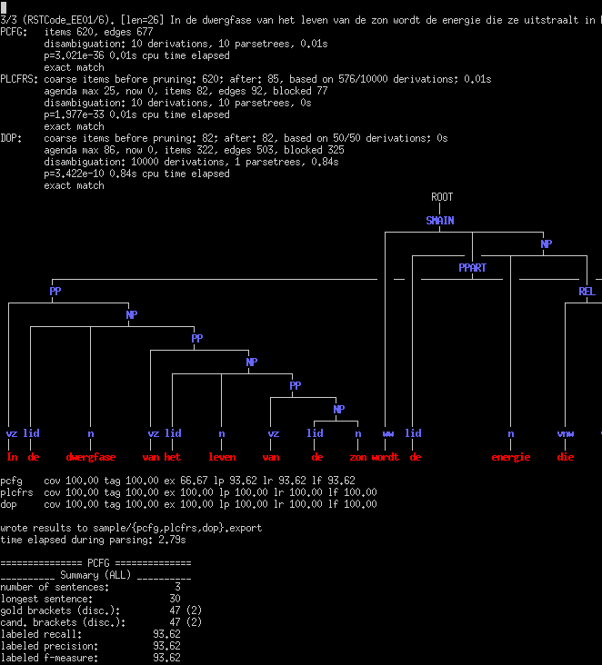
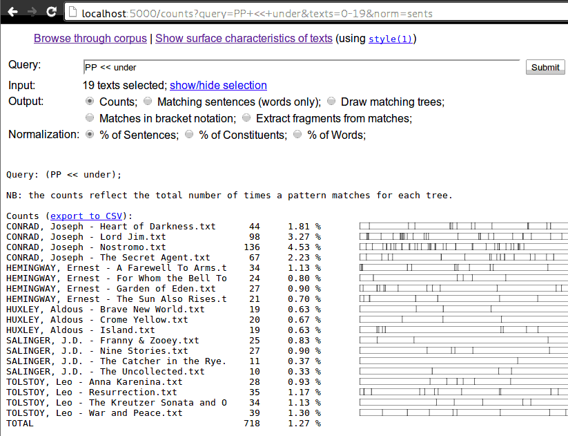
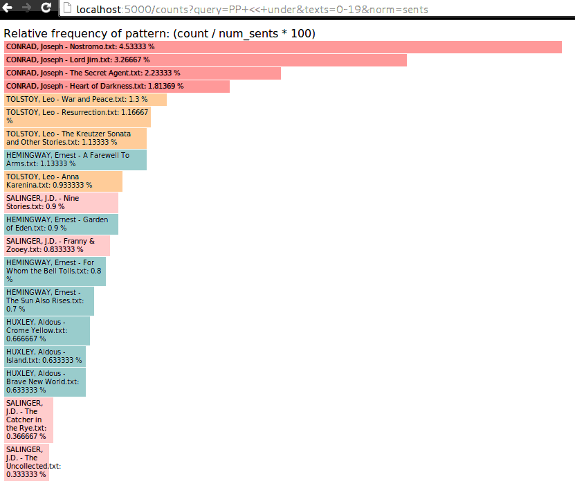

Getting started
===============

.. contents::

Parsing a text
--------------
The parser can be used as an off-the-shelf parser using an existing grammar model,
either one of the `grammars used in the 2013 IWPT paper
<http://staff.science.uva.nl/~acranenb/grammars/>`_ for English, German, and
Dutch, or a model produced by ``discodop runexp`` or ``discodop grammar param``.
The text needs to be tokenized, for example using `ucto
<http://ilk.uvt.nl/ucto>`_, the output of which can be passed to the parser::

    $  ucto -L en -n "CONRAD, Joseph - Lord Jim.txt" | discodop parser wsj/

To parse sentences in bracketed format::

    $ discodop treetransforms none treebankExample.mrg --inputfmt=bracket --outputfmt=tokens | discodop parser wsj/

Inducing a simple grammar
-------------------------

Suppose we have the following treebank in the file ``treebankExample.mrg``::

    (S (NP (DT The) (NN cat)) (VP (VBP saw) (NP (DT the) (JJ hungry) (NN dog))))
    (S (NP (DT The) (NN cat)) (VP (VBP saw) (NP (DT the) (NN dog))))
    (S (NP (DT The) (NN mouse)) (VP (VBP saw) (NP (DT the) (NN cat))))
    (S (NP (DT The) (NN mouse)) (VP (VBP saw) (NP (DT the) (JJ yellow) (NN cat))))
    (S (NP (DT The) (JJ little) (NN mouse)) (VP (VBP saw) (NP (DT the) (NN cat))))
    (S (NP (DT The) (NN cat)) (VP (VBP ate) (NP (DT the) (NN dog))))
    (S (NP (DT The) (NN mouse)) (VP (VBP ate) (NP (DT the) (NN cat))))

You can view the trees using the following command::

    $ discodop treedraw < treebankExample.mrg | less -R

Before inducing a grammar, we need to binarize the treebank::

    $ discodop treetransforms binarize --fmt=bracket treebankExample.mrg /tmp/bintrees
    transformed 7 trees with action 'binarize'

We can then induce a Double-DOP grammar with the following command::

    $ discodop grammar doubledop --inputfmt=bracket /tmp/bintrees /tmp/example
    extracting recurring fragments
    [...]
    found 34 fragments
    wrote backtransform to /tmp/example.backtransform
    wrote grammar to /tmp/example.rules and /tmp/example.lex.
    [...]

This produces a grammar consisting of a series of text files in ``/tmp``, which
can be used as follows::

    $ echo 'The cat saw the hungry dog' | discodop parser --simple /tmp/example.rules /tmp/example.lex --bt=/tmp/example.backtransform -s S -b 5
    parsing 0: The cat saw the hungry dog
    (S (NP (DT 0) (NN 1)) (VP (VBP 2) (NP (DT 3) (NP|<JJ,NN> (JJ 4) (NN 5)))))
    0.0 s
    [...]

Note that the ``-s`` option should specify the root label of the trees in the treebank.

Run an experiment
-----------------
To parse with large treebanks, it may be necessary to apply pruning, and it
is useful to specify the configuration for an experiment in a single file.
This can be done with the ``discodop runexp`` command.

To run an end-to-end experiment from grammar extraction to evaluation on a test
set, make a copy of the file ``sample.prm`` and edit its parameters. For
example:

.. code-block:: python

    stages=[
        dict(name='pcfg', mode='pcfg',
            split=True, markorigin=True),
        dict(name='plcfrs', mode='plcfrs',
            prune='pcfg', splitprune=True, k=1000),
        dict(name='dop', mode='plcfrs',
            prune='plcfrs', k=50, m=1000,
            dop='doubledop',
            estimator='rfe', objective = 'mpp')
    ],
    traincorpus=dict(
        path='alpinosample.export', encoding='utf-8',
        numsents=3, maxwords=100),
    testcorpus=dict(
        path='alpinosample.export', encoding='utf-8',
        numsents=3, maxwords=100, skiptrain=False),
    postagging=dict(
        method='unknownword', model='4',
        unknownthreshold=1, openclassthreshold=50,
        simplelexsmooth=True),
    binarization=dict(
        method='default', factor='right',
        h=1, v=1),

See the documentation on the available :doc:`parameters <params>`.
These parameters can be invoked by executing::

    $ discodop runexp filename.prm

This will create a new directory with the base name of the parameter file, i.e.,
``filename/`` in this case. This directory must not exist yet, to avoid
accidentally overwriting previous results. The directory will contain the
grammar rules and lexicon in a text format, as well as the parsing results and
the gold standard file in Negra's export format.

Note that there is an option to utilize multiple processor cores by launching a
specific number of processes. This greatly speeds up parsing, but note that for
a nontrivial DOP grammar, each process may require anywhere from 4GB to 16GB.

Corpora can be read in Negra's export format, or in the bracketed Penn
treebank format. Access to the
`Negra corpus <http://www.coli.uni-saarland.de/projects/sfb378/negra-corpus/>`_
can be requested for non-commercial purposes, while the
`Tiger corpus <http://www.ims.uni-stuttgart.de/projekte/TIGER/TIGERCorpus/>`_
is freely available for download for research purposes.

Alternatively, it is possible to achieve similar results with separate commands::

    $ discodop grammar param filename.prm filename/
    $ discodop none alpinosample.export sentences.txt --inputfmt=export --outputfmt=tokens
    $ discodop parser filename/ sentences.txt --fmt=export >filename/dop.export
    $ discodop eval alpinosample.export filename/dop.export proper.prm

IPython notebooks
-----------------

- `A tutorial on using tree fragments for text classification <http://nbviewer.ipython.org/gist/andreasvc/9467e27680d8950045b2/treefragments.ipynb>`_
- `Getting tree fragments from TSG derivations <http://nbviewer.ipython.org/gist/andreasvc/f6f626aadb7fd7fb4954>`_

Overview
========

Command-line tools
------------------
Aside from the parser there are some standalone tools, invoked as ``discodop <cmd>``:

``fragments``
    Finds recurring or common fragments in one or more treebanks.
    It can be used with discontinuous as well as Penn-style bracketed treebanks.
    Example::

    $ discodop fragments wsj-02-21.mrg > wsjfragments.txt

    Specify the option ``--numproc n`` to use multiple processes, as with ``runexp``.

``eval``
    Discontinuous evaluation. Reports F-scores and other metrics.
    Accepts ``EVALB`` parameter files:

    ``$ discodop eval sample/gold.export sample/dop.export proper.prm``

``treetransforms``
    A command line interface to perform transformations on
    treebanks such as binarization.

``grammar``
    A command line interface to read off grammars from (binarized)
    treebanks.

``treedraw``
    Visualize (discontinuous) trees. Command-line interface:

    ``$ discodop treedraw < negra-corpus.export | less -RS``

``parser``
    A basic command line interface to the parser comparable to bitpar.
    Reads grammars from text files.

``demos``
    Contains examples of various formalisms encoded in LCFRS grammars.

``gen``
    An experiment in generation with LCFRS.

For instructions, pass the ``--help`` option to a command.

Web interfaces
--------------
There are three web based tools in the ``web/`` directory. These require
Flask & pandas to be installed::

    pip install --user -r web/requirements.txt

``parse.py``
    A web interface to the parser. Expects a series of grammars
    in subdirectories of ``web/grammars/``, each containing grammar files
    as produced by running ``discodop runexp``.
    `Download grammars <http://staff.science.uva.nl/~acranenb/grammars/>`_
    for English, German, and Dutch, as used in the 2013 IWPT paper.

``treesearch.py``
    A web interface for searching through treebanks. Expects
    one or more treebanks with the ``.mrg`` or ``.dact`` extension in the
    directory ``web/corpus/`` (sample included). Depends on
    `tgrep2 <http://tedlab.mit.edu/~dr/Tgrep2/>`_,
    `alpinocorpus <https://github.com/rug-compling/alpinocorpus-python>`_, and
    `readability <https://github.com/andreasvc/readability>`_.

``treedraw.py``
    A web interface for drawing discontinuous trees in various
    formats.

